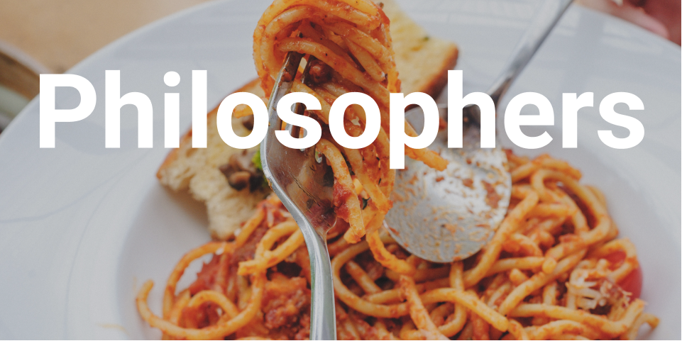

# philosophers
🍝 Dining philosophers problem

Photo by <a href="https://unsplash.com/@keriliwi?utm_source=unsplash&amp;utm_medium=referral&amp;utm_content=creditCopyText">Keriliwi</a> on <a href="https://unsplash.com/s/photos/spaghetti-fork?utm_source=unsplash&amp;utm_medium=referral&amp;utm_content=creditCopyText">Unsplash</a>

## Philo one
Threads and mutexes

## Philo two
Threads and semaphores

## Philo three
Processes, threads and semaphores

* [Wiki](https://en.wikipedia.org/wiki/Dining_philosophers_problem)
* [Dining philosophers problem live](https://youtu.be/trdXKhWAGdg)
